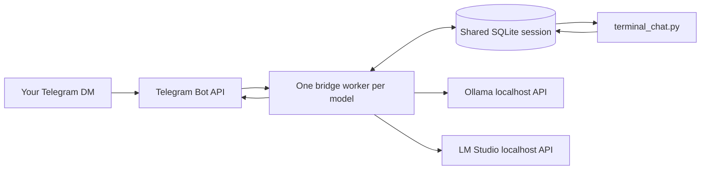

# Local Telegram Bridge

Chat with **Ollama and LM Studio models running on your own computer** from a private Telegram bot or an interactive terminal.
Both clients share the same per-model queue, conversation, `/clear`, and durable event journal.
Python 3.9+ and the standard library are enough. macOS and Linux are supported; the included service installer is for macOS.

This is a text chat bridge. It calls model APIs directly and does not control terminal sessions, edit files, run model-generated shell commands, or provide an autonomous coding agent. The included terminal program is a client of the bridge queue; it does not call or load a model itself.

## How it works



Inference happens locally. **Telegram still transports your messages.** This is not an offline messenger, and it does not make Telegram bot chats end-to-end encrypted. There is no cloud LLM fallback.

## Setup

```bash
git clone https://github.com/ssamssae/local-telegram-bridge.git
cd local-telegram-bridge
```

1. Install Ollama and/or LM Studio, download a model that fits your hardware, and verify it responds locally. For LM Studio, open the app once so its `lms` CLI is available.
2. Create a bot with Telegram's **@BotFather**, start a private chat with your bot, and obtain your own numeric Telegram user ID. The bridge accepts messages only when the private chat ID and sender ID both match `owner_id`.
3. Copy `examples/config.example.json` (Ollama + LM Studio) or `examples/config.lmstudio.json` (two LM Studio models) to a private location outside this repository, for example `~/.config/local-telegram-bridge/config.json`. Set your `owner_id`, model identifiers, and profiles. Delete profiles you do not use. Configs that should share conversations must use the same `session_db` path.
4. Supply the token through `TELEGRAM_BOT_TOKEN`, or add `"token_file": "~/.config/local-telegram-bridge/bot-token.txt"` to the private config. The token file may contain just the token or JSON with a `token` or `api_key` field. Keep private config and token files readable only by your account (`chmod 600`). Do not put tokens in shell command arguments or commit them to Git.
5. Stop any older process polling the same bot. Each bot must have one active poller. This bridge refuses to start if a webhook is configured and does not remove webhooks automatically.

```bash
python3 local_bridge.py --config ~/.config/local-telegram-bridge/config.json --check
python3 local_bridge.py --config ~/.config/local-telegram-bridge/config.json --register-commands
python3 local_bridge.py --config ~/.config/local-telegram-bridge/config.json
```

`--check` verifies the Telegram identity and configuration without consuming updates. It does not load model weights.

For macOS login startup, use a token file (shell environment variables are not automatically inherited by launchd), then run:

```bash
python3 install_macos.py --config ~/.config/local-telegram-bridge/config.json
```

The installer copies the bridge into `~/.local/share/local-telegram-bridge/` and creates `~/Library/LaunchAgents/com.local-telegram-bridge.plist`. Logs are in `~/Library/Logs/local-telegram-bridge/`. Re-run the installer after updating the source. To stop the installed service:

```bash
launchctl bootout "gui/$(id -u)/com.local-telegram-bridge"
```

## Commands

### One bot per model

Set `"fixed_profile": "20b"` or `"fixed_profile": "qwen"` in a bot's private config to bind it to that model. Fixed bots expose only `/clear`, `/status`, and `/help`; `/model`, profile shortcuts, and old model-selection buttons cannot switch the model. A previously saved selection does not override the binding.

For two bots, create two BotFather tokens and two configs with **different `token_file` and `state_file` paths**. Keep the same `inference_lock_file` in both configs and any cooperating terminal clients. Keep both models in `profiles` with `unload_other_profiles: true` so either bot can release its peer's model before loading its own. Only `fixed_profile` is available for chat.

Install both macOS services separately:

```bash
python3 install_macos.py --config ~/.config/local-telegram-bridge/config.json
python3 install_macos.py --config ~/.config/local-telegram-bridge/qwen.json --instance qwen
```

The second service is `com.local-telegram-bridge-qwen` and writes to `~/Library/Logs/local-telegram-bridge-qwen/`. Register commands separately for each config. Start a private chat with each bot before expecting replies. Polling offsets belong to a bot token: when migrating history to a new bot, copy only that model's history into a fresh state with offset `0` and an empty outbox, never copy the old bot's polling offset or pending replies.

Open the matching shared conversation from a terminal with the same private config:

```bash
python3 terminal_chat.py --config ~/.config/local-telegram-bridge/config.json --profile 20b
python3 terminal_chat.py --config ~/.config/local-telegram-bridge/qwen.json --profile qwen
```

The installed copies are under `~/.local/share/local-telegram-bridge/`. `--check` validates the config, profile, and session database without contacting Telegram or loading a model. A fixed-profile config rejects a different `--profile`; terminal `/model`, `/models`, and profile shortcuts are intentionally unavailable.

## Shared session contract

- SQLite is the source of truth for the per-profile request inbox, active transcript, append-only event journal, and pending Telegram outbox. The database is mode `0600`; newly created state and worker-lock directories are mode `0700`.
- The bridge holds a non-blocking worker lock for every profile it serves. A fixed bot holds only its fixed profile; the optional multi-profile bridge holds all configured profiles. A second bridge cannot process the same profile.
- Telegram updates and terminal submissions receive stable source keys. Repeated Telegram updates and concurrent duplicate submissions create one request. Different inputs are processed in database order.
- A model answer and its user/assistant transcript pair, event, and Telegram outbox rows commit in one transaction. Failed inference records an error event but does not append the question to active model history.
- On bridge restart, a request left in `running` is requeued after the bridge reacquires that profile's worker lock. A crash before the answer transaction may repeat local inference, but cannot commit duplicate transcript or event rows for the request.
- The bridge keeps the existing `inference_lock_file` around unload, load, and inference. Two fixed bot configs must specify the same lock path as well as the same session database while keeping their token and `state_file` paths separate.
- A terminal client only writes requests and reads events. Telegram-origin questions and answers appear there; terminal-origin questions and answers are placed in the matching bot's durable Telegram outbox. Asynchronous events clear and redraw the current line with the readline buffer intact, so partially typed input is not discarded.
- Telegram delivery remains at least once: a crash after Telegram accepted a message but before the SQLite acknowledgement may duplicate that message. Pending rows are retried after restart without regenerating the model answer.

### Optional model selection

Without `fixed_profile`, one bot can select between the configured models:

| Command | Behavior |
| --- | --- |
| `/model` or `/models` | Open model selection buttons; the current model has a check mark |
| `/clear` | Clear the selected model's conversation |
| `/status` | Show the selected model and saved conversation length |
| `/help` | List the configured profiles and commands |

Tap a model button, then send your question. Each model retains its own conversation when switching. Configured profile names also remain available as shortcuts (for example `/qwen` and `/20b`). The old `/new` command explains the rename without clearing history. Replies include the model label so you can tell which model answered. Photos, voice messages, and documents are not supported in this version.

## Models and memory

- Backend URLs must point to `http://localhost`, `http://127.0.0.1`, or `http://[::1]`. The bridge uses outbound Telegram long polling; no public port is required.
- Use `lms ls --json` to find the LM Studio **modelKey**, and `ollama list` for Ollama model names. The example model names are editable and no model weights are included.
- LM Studio uses its CLI to load the configured model with one concurrent request, the configured context length, MTP disabled, and an idle TTL. On macOS, `start_app: true` allows the bridge to open LM Studio when needed. On Linux, start LM Studio or its daemon first.
- `inference_lock_file` serializes every cooperating bridge for the entire unload/load/inference operation. Both examples enable it. The terminal client never takes this lock because it never calls the model; the bridge processing its queued request does. LM Studio GUI and unrelated clients do not participate.
- `unload_other_profiles: true` unloads other configured models before inference. This is useful when two models cannot fit in memory together. It also affects other clients sharing those model instances: do not run simultaneous terminal and Telegram jobs against the same large models. It does not unload unrelated model names or alter system memory limits.
- Ollama receives the configured context length, output-token limit, and idle TTL. Thinking behavior follows the selected model's configuration.
- A profile can set `system` to preserve a custom assistant prompt. LM Studio does not automatically inherit an Ollama Modelfile prompt.
- Conversation retention is bounded by `history_turns`, not by an exact token counter. When a conversation exceeds the backend's context window, use `/clear`.

## Recovery and privacy

Per-bot selection and polling offset remain in the private JSON state. Shared histories and unsent session replies are committed atomically to the mode-`0600` SQLite database. Failed inference is not appended to conversation history. Replies are removed from the outbox only after Telegram returns a message ID. A network failure or restart retries unsent replies without repeating an already persisted model generation.

Delivery is **at least once**, not exactly once: a crash between Telegram accepting a message and saving that acknowledgement can duplicate the last chunk. Requests are processed sequentially; commands wait while a model is answering. A token-specific local process lock prevents two instances of this bridge from polling the same bot; it cannot lock unrelated bridge software or another computer.

The bridge never logs the token-bearing Telegram URL or message text. Conversation text is stored in the private session database; Telegram and model-server logs have their own retention policies. GitHub should contain only this source, examples, documentation, and tests—not credentials, real user IDs, chat histories, model files, or local runtime logs.

### Migrating old JSON histories

Stop the old bridge and standalone `oo`/`oq` chat before migration. Keep the old files as backups; the tool reads but never edits them. First preview the import:

```bash
python3 migrate_history.py \
  --config ~/.config/local-telegram-bridge/config.json \
  --telegram-state ~/.local/state/local-telegram-bridge/state.json \
  --telegram-state ~/.local/state/local-telegram-bridge/qwen-state.json \
  --terminal-history 20b=/path/to/oo/conversation.json \
  --terminal-history qwen=/path/to/oq/conversation.json
```

If Telegram and terminal have different histories for one profile, the tool refuses to guess an ordering. Choose the active conversation explicitly with `--prefer telegram` or `--prefer terminal`, review the counts, then repeat with `--execute`. Every candidate is archived in the private database's `legacy_imports` table even when it is not selected; the chosen candidate becomes active history. The destination profile must be empty, so reruns cannot silently duplicate or overwrite a live conversation.

The bridge detects a non-empty legacy JSON history with an empty shared profile and asks for this migration instead of silently choosing one. Polling offsets and existing unsent Telegram replies remain in each bot's separate `state_file`; do not merge or copy them between bot tokens.

## Tests

```bash
python3 -m unittest discover -s tests -v
```

Tests cover inference-lock coordination, owner-only access, model separation, shared terminal/Telegram sessions, restart recovery, concurrent duplicate submissions, failed delivery, failed inference, input-buffer redisplay, UTF-16 message boundaries, and credential-safe diagnostics. They use fake model and Telegram endpoints and never send real messages.

## 한국어 안내

텔레그램에서 로컬 Ollama·LM Studio 모델과 대화하는 브릿지입니다. `/model`을 보내고 버튼으로 모델을 선택하세요. `/clear`는 현재 모델의 새 대화를 시작합니다. 모델 연산은 컴퓨터에서 하지만 메시지는 텔레그램을 거칩니다. 컴퓨터와 브릿지가 실행 중이어야 답할 수 있습니다.

공개 저장소에는 코드와 예시만 넣으세요. 봇 토큰·실제 사용자 ID·대화 기록은 개인 설정 폴더에 보관합니다. 모델 종류와 이름은 설정에서 바꿀 수 있습니다. 두 모델 모두 LM Studio로 실행하려면 `examples/config.lmstudio.json`을 사용하세요.

## References

- [Telegram Bot API](https://core.telegram.org/bots/api)
- [LM Studio chat completions](https://lmstudio.ai/docs/developer/openai-compat/chat-completions)
- [LM Studio model loading](https://lmstudio.ai/docs/cli/local-models/load)
- [Ollama chat API](https://docs.ollama.com/api/chat)

## License

MIT. Model weights and third-party applications retain their own licenses.
