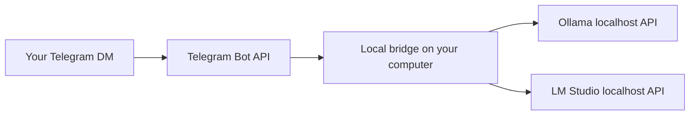

# Local Telegram Bridge

Chat with **Ollama and LM Studio models running on your own computer** from a private Telegram bot.
Choose a model with `/model` buttons, start a fresh conversation with `/clear`, and continue after a bridge restart.
Python 3.9+ and the standard library are enough. macOS and Linux are supported; the included service installer is for macOS.

This is a text chat bridge. It calls model APIs directly and does not control terminal sessions, edit files, run model-generated shell commands, or provide an autonomous coding agent.

## How it works



Inference happens locally. **Telegram still transports your messages.** This is not an offline messenger, and it does not make Telegram bot chats end-to-end encrypted. There is no cloud LLM fallback.

## Setup

```bash
git clone https://github.com/ssamssae/local-telegram-bridge.git
cd local-telegram-bridge
```

1. Install Ollama and/or LM Studio, download a model that fits your hardware, and verify it responds locally. For LM Studio, open the app once so its `lms` CLI is available.
2. Create a bot with Telegram's **@BotFather**, start a private chat with your bot, and obtain your own numeric Telegram user ID. The bridge accepts messages only when the private chat ID and sender ID both match `owner_id`.
3. Copy `examples/config.example.json` (Ollama + LM Studio) or `examples/config.lmstudio.json` (two LM Studio models) to a private location outside this repository, for example `~/.config/local-telegram-bridge/config.json`. Set your `owner_id`, model identifiers, and profiles. Delete profiles you do not use.
4. Supply the token through `TELEGRAM_BOT_TOKEN`, or add `"token_file": "~/.config/local-telegram-bridge/bot-token.txt"` to the private config. The token file may contain just the token or JSON with a `token` or `api_key` field. Keep private config and token files readable only by your account (`chmod 600`). Do not put tokens in shell command arguments or commit them to Git.
5. Stop any older process polling the same bot. Each bot must have one active poller. This bridge refuses to start if a webhook is configured and does not remove webhooks automatically.

```bash
python3 local_bridge.py --config ~/.config/local-telegram-bridge/config.json --check
python3 local_bridge.py --config ~/.config/local-telegram-bridge/config.json --register-commands
python3 local_bridge.py --config ~/.config/local-telegram-bridge/config.json
```

`--check` verifies the Telegram identity and configuration without consuming updates. It does not load model weights.

For macOS login startup, use a token file (shell environment variables are not automatically inherited by launchd), then run:

```bash
python3 install_macos.py --config ~/.config/local-telegram-bridge/config.json
```

The installer copies the bridge into `~/.local/share/local-telegram-bridge/` and creates `~/Library/LaunchAgents/com.local-telegram-bridge.plist`. Logs are in `~/Library/Logs/local-telegram-bridge/`. Re-run the installer after updating the source. To stop the installed service:

```bash
launchctl bootout "gui/$(id -u)/com.local-telegram-bridge"
```

## Commands

| Command | Behavior |
| --- | --- |
| `/model` or `/models` | Open model selection buttons; the current model has a check mark |
| `/clear` | Clear the selected model's conversation |
| `/status` | Show the selected model and saved conversation length |
| `/help` | List the configured profiles and commands |

Tap a model button, then send your question. Each model retains its own conversation when switching. Configured profile names also remain available as shortcuts (for example `/qwen` and `/20b`). The old `/new` command explains the rename without clearing history. Replies include the model label so you can tell which model answered. Photos, voice messages, and documents are not supported in this version.

## Models and memory

- Backend URLs must point to `http://localhost`, `http://127.0.0.1`, or `http://[::1]`. The bridge uses outbound Telegram long polling; no public port is required.
- Use `lms ls --json` to find the LM Studio **modelKey**, and `ollama list` for Ollama model names. The example model names are editable and no model weights are included.
- LM Studio uses its CLI to load the configured model with one concurrent request, the configured context length, MTP disabled, and an idle TTL. On macOS, `start_app: true` allows the bridge to open LM Studio when needed. On Linux, start LM Studio or its daemon first.
- `inference_lock_file` serializes this bridge with any other local client that takes an exclusive `flock` on the same file for the entire unload/load/inference operation. Both examples enable it. A terminal client must use that same lock to participate; LM Studio GUI and unrelated clients do not.
- `unload_other_profiles: true` unloads other configured models before inference. This is useful when two models cannot fit in memory together. It also affects other clients sharing those model instances: do not run simultaneous terminal and Telegram jobs against the same large models. It does not unload unrelated model names or alter system memory limits.
- Ollama receives the configured context length, output-token limit, and idle TTL. Thinking behavior follows the selected model's configuration.
- A profile can set `system` to preserve a custom assistant prompt. LM Studio does not automatically inherit an Ollama Modelfile prompt.
- Conversation retention is bounded by `history_turns`, not by an exact token counter. When a conversation exceeds the backend's context window, use `/clear`.

## Recovery and privacy

Selection, separate histories, polling offset, and unsent replies are saved atomically in a file with mode `0600`. Failed inference is not appended to conversation history. Replies are removed from the outbox only after Telegram returns a message ID. A network failure or restart retries unsent replies without repeating an already persisted model generation.

Delivery is **at least once**, not exactly once: a crash between Telegram accepting a message and saving that acknowledgement can duplicate the last chunk. Requests are processed sequentially; commands wait while a model is answering. A token-specific local process lock prevents two instances of this bridge from polling the same bot; it cannot lock unrelated bridge software or another computer.

The bridge never logs the token-bearing Telegram URL or message text. Conversation text is stored in the private state file, and Telegram and model-server logs have their own retention policies. GitHub should contain only this source, examples, documentation, and tests—not credentials, real user IDs, chat histories, model files, or local runtime logs.

## Tests

```bash
python3 -m unittest discover -s tests -v
```

Tests cover inference-lock coordination, owner-only access, model separation, restart recovery, failed delivery, duplicate updates, failed inference, UTF-16 message boundaries, and credential-safe diagnostics. They use fake model and Telegram endpoints and never send real messages.

## 한국어 안내

텔레그램에서 로컬 Ollama·LM Studio 모델과 대화하는 브릿지입니다. `/model`을 보내고 버튼으로 모델을 선택하세요. `/clear`는 현재 모델의 새 대화를 시작합니다. 모델 연산은 컴퓨터에서 하지만 메시지는 텔레그램을 거칩니다. 컴퓨터와 브릿지가 실행 중이어야 답할 수 있습니다.

공개 저장소에는 코드와 예시만 넣으세요. 봇 토큰·실제 사용자 ID·대화 기록은 개인 설정 폴더에 보관합니다. 모델 종류와 이름은 설정에서 바꿀 수 있습니다. 두 모델 모두 LM Studio로 실행하려면 `examples/config.lmstudio.json`을 사용하세요.

## References

- [Telegram Bot API](https://core.telegram.org/bots/api)
- [LM Studio chat completions](https://lmstudio.ai/docs/developer/openai-compat/chat-completions)
- [LM Studio model loading](https://lmstudio.ai/docs/cli/local-models/load)
- [Ollama chat API](https://docs.ollama.com/api/chat)

## License

MIT. Model weights and third-party applications retain their own licenses.
